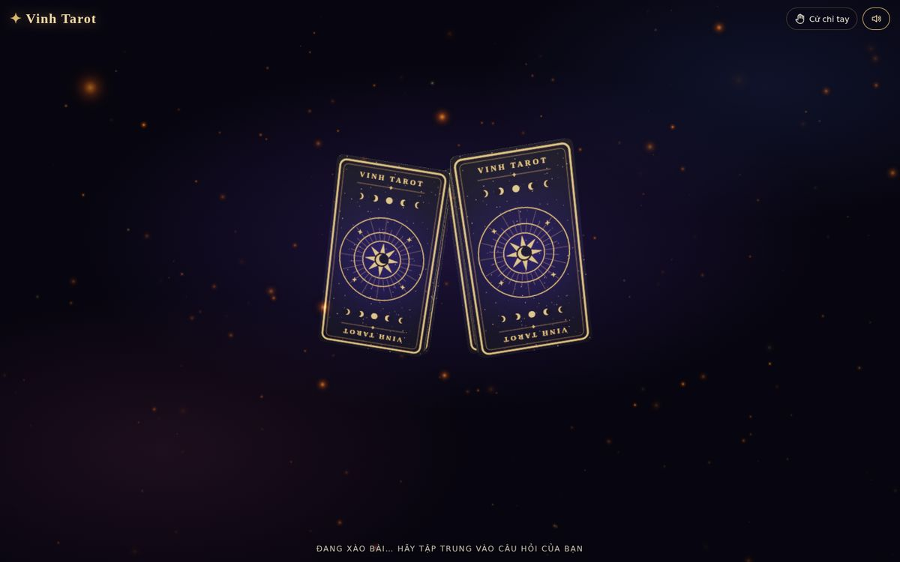
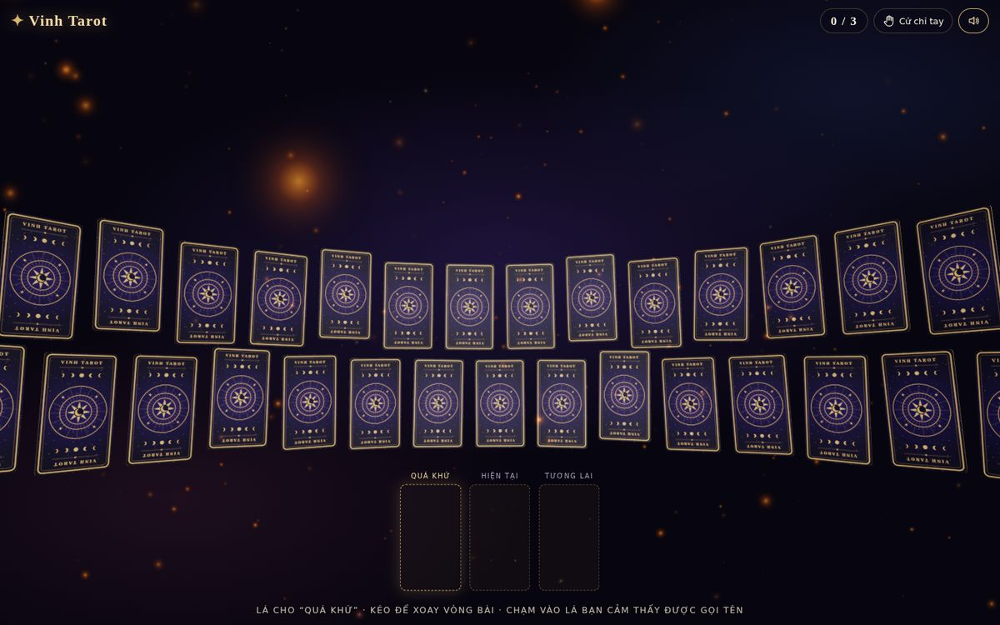
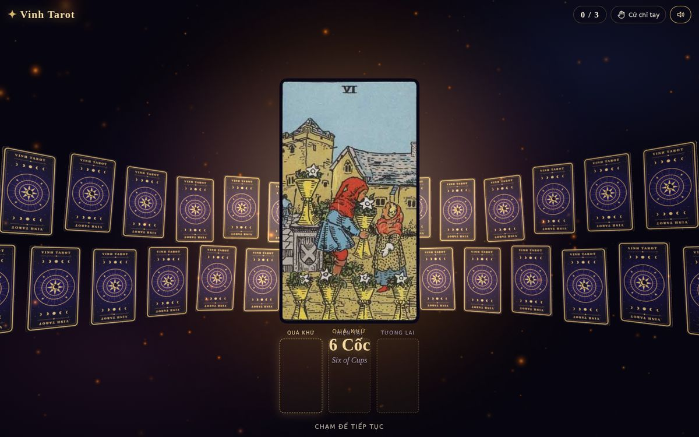
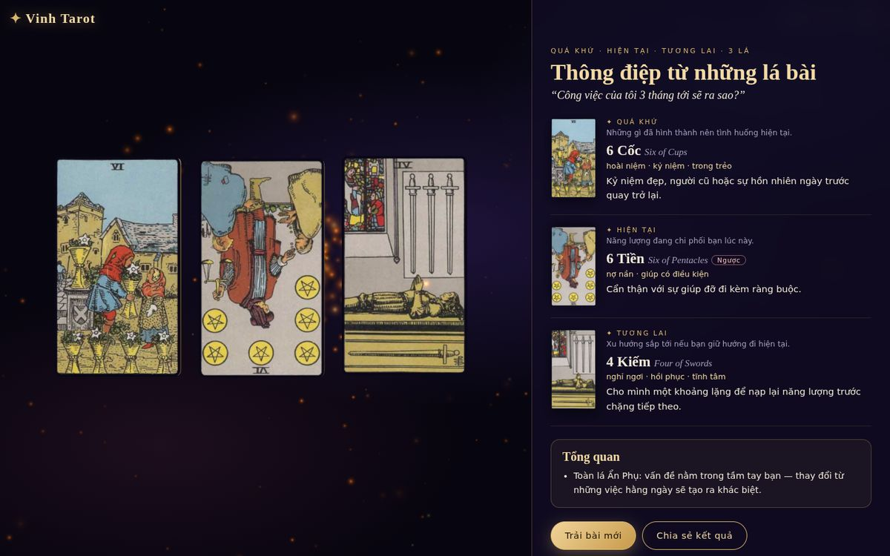
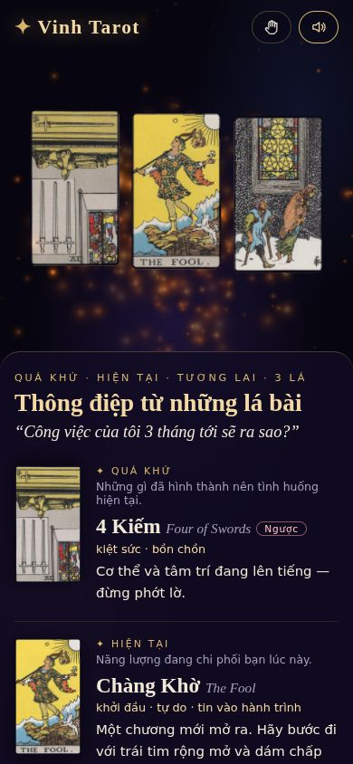

# Vinh Tarot — Rút bài Tarot 3D

Trang rút bài Tarot 3D cho **vinhtarot.com**: xào bài riffle 3D, vòng bài bao quanh người xem, chọn lá bằng
chuột / cảm ứng / bàn phím / **cử chỉ tay qua webcam**, lật bài có nổ hạt sáng, giải nghĩa đủ 78 lá tiếng Việt.

Trang thuần tĩnh (HTML + ES module), **không cần build, không cần server riêng**.

📖 Giải thích kỹ thuật chi tiết: [`docs/HOAT-ANH-3D.md`](docs/HOAT-ANH-3D.md)

| Xào bài riffle | Vòng bài 2 tầng | Lật bài | Giải nghĩa | Điện thoại |
|---|---|---|---|---|
|  |  |  |  |  |

## Chạy thử trên máy

```bash
cd vinhtarot
python3 -m http.server 8080      # hoặc: npx serve .
# mở http://localhost:8080
```

> Phải mở qua `http://localhost` hoặc `https://` — mở trực tiếp file `index.html` sẽ bị chặn ES module,
> và camera chỉ hoạt động trên HTTPS (hoặc localhost).

## Đưa lên vinhtarot.com

Tải **nguyên thư mục `vinhtarot/`** lên hosting. Ba cách phổ biến:

| Cách | Làm gì | Ghi chú |
|---|---|---|
| **Thư mục con** của web đang có | Upload vào `public_html/rut-bai/` → `https://vinhtarot.com/rut-bai/` | Mọi đường dẫn trong code đều là tương đối nên chạy được ở thư mục con |
| **Cloudflare Pages / Netlify / Vercel** | Kéo-thả thư mục, trỏ tên miền phụ `boi.vinhtarot.com` | Miễn phí, HTTPS tự động, CDN toàn cầu |
| **Nhúng vào trang WordPress/Ladipage** | `<iframe src="https://vinhtarot.com/rut-bai/" allow="camera; fullscreen" style="width:100%;height:100vh;border:0"></iframe>` | Bắt buộc có `allow="camera"` thì cử chỉ tay mới chạy |

## Tuỳ biến

Sửa `js/config.js`:

```js
export const BRAND = {
  name: 'Vinh Tarot',
  backText: 'VINH TAROT',                 // chữ trên mặt lưng lá bài
  bookingUrl: 'https://m.me/<trang-cua-ban>', // nút "Đặt lịch xem chuyên sâu"
  bookingLabel: 'Đặt lịch xem chuyên sâu',
};
```

Nội dung nghĩa lá, kiểu trải bài (1 lá / 3 lá thời gian / 3 lá tình yêu / 5 lá công việc) nằm ở `js/deck-data.js`.

## Gắn đo lường / lưu kết quả

Mỗi lần trải bài xong, trang phát sự kiện `vinhtarot:reading` trên `window`:

```html
<script>
  window.addEventListener('vinhtarot:reading', (e) => {
    // e.detail = { spread, question, cards: [{ id, name, reversed, position }] }
    gtag?.('event', 'tarot_reading', { spread: e.detail.spread, cards: e.detail.cards.map(c => c.id).join(',') });
    fbq?.('trackCustom', 'TarotReading', { spread: e.detail.spread });
  });
</script>
```

## Cập nhật three.js

`vendor/three.module.min.js` là three.js r186 đã tree-shake theo danh sách trong `tools/three-entry.js`:

```bash
npm i three@0.186.1 esbuild
npx esbuild tools/three-entry.js --bundle --format=esm --minify --legal-comments=eof --outfile=vendor/three.module.min.js
cp node_modules/three/examples/jsm/environments/RoomEnvironment.js vendor/addons/environments/
```

## Giấy phép & nguồn

* Mã nguồn trong thư mục này: viết mới cho Vinh Tarot. Ý tưởng tương tác lấy cảm hứng từ tarotcuabin.com, nhưng
  **không sao chép mã, hình ảnh hay thương hiệu** của trang đó (repo của họ không có giấy phép sử dụng).
* Ảnh 78 lá: bộ Rider–Waite–Smith bản in 1909, minh hoạ Pamela Colman Smith — **phạm vi công cộng**. Không dùng
  tên thương mại "Rider-Waite®" (nhãn hiệu của U.S. Games Systems) để quảng cáo.
* Mặt lưng lá bài, texture sao, âm thanh: tạo bằng code (Canvas 2D / Web Audio).
* three.js — MIT (`vendor/THREE-LICENSE.txt`). MediaPipe Tasks Vision — Apache-2.0, tải từ jsDelivr/Google khi
  người dùng bật cử chỉ tay.
* Nội dung giải nghĩa: tự biên soạn; Tarot mang tính tham khảo, chiêm nghiệm.
